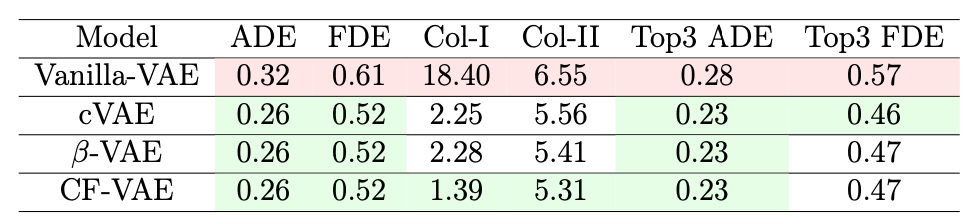

# trajnetplusplus

This projects aims at creating 2 new baselines in the Trajnet++ framework:
- VAE baseline 
- CF-VAE baseline

More info about how to run the code can be found [here](https://thedebugger811.github.io/posts/2020/03/intro_trajnetpp/)

The results obtained by the different models are shown in the following tables:

